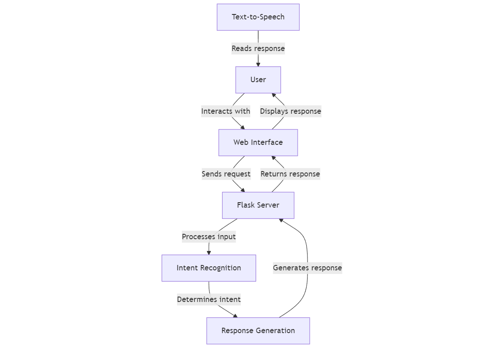

## Waterloo Services Chatbot

This project is a simple chatbot (mvp) demo that provides information about various services in the Waterloo region, including garbage collection, parks, and transit.

### Architecture



### Prerequisites

Before you begin, ensure you have met the following requirements:  
\* You have installed Python 3.7 or later.  
\* You have a Windows/Linux/Mac machine.

### Installing Waterloo Services Chatbot

To install the Waterloo Services Chatbot, follow these steps:

1\. Clone the repository or unzip the project files into a directory of your choice.  
2\. Navigate to the project directory in your terminal or command prompt.  
3\. Create a virtual environment (optional but recommended):  
 ```
   python \-m venv venv  
 ``` 
4\. Activate the virtual environment:  

   \* On Windows:  
``` 
     venv\\Scripts\\activate  

```  
   \* On macOS and Linux:  
``` 
   source venv/bin/activate  
 ```

5\. Install the required packages:  

```  
   pip install \-r requirements.txt  
```


### Running the Waterloo Services Chatbot

To run the Waterloo Services Chatbot, follow these steps:

1\. Ensure you're in the project directory and your virtual environment is activated (if you're using one).  
2\. Start the Flask server:  
```
   python app.py  
 ```
   You should see output indicating that the server is running, typically on \`http://127.0.0.1:5000/\`.  
3\. Open the \`index.html\` file in a web browser. You can do this by:  
   \* Double-clicking the file in your file explorer, or  
   \* Right-clicking the file and selecting "Open with" and then choosing your preferred web browser.

4\. You should now see the chatbot interface in your web browser. Type a message in the input box and press Send or hit Enter to interact with the chatbot.

### Using the Waterloo Services Chatbot

You can ask the chatbot about:  
\* Garbage collection (e.g., "When is garbage pickup for 123 King Street?")  
\* Parks (e.g., "Tell me about parks in Waterloo")  
\* Transit (e.g., "How much does a bus ride cost?")

The chatbot will do its best to provide relevant information based on your queries.

### Troubleshooting

If you encounter any issues:  
1\. Ensure all dependencies are correctly installed.  
2\. Check that the Flask server is running without errors.  
3\. If you see CORS errors in your browser console, make sure you're running the HTML file directly from your file system and not through a web server.

